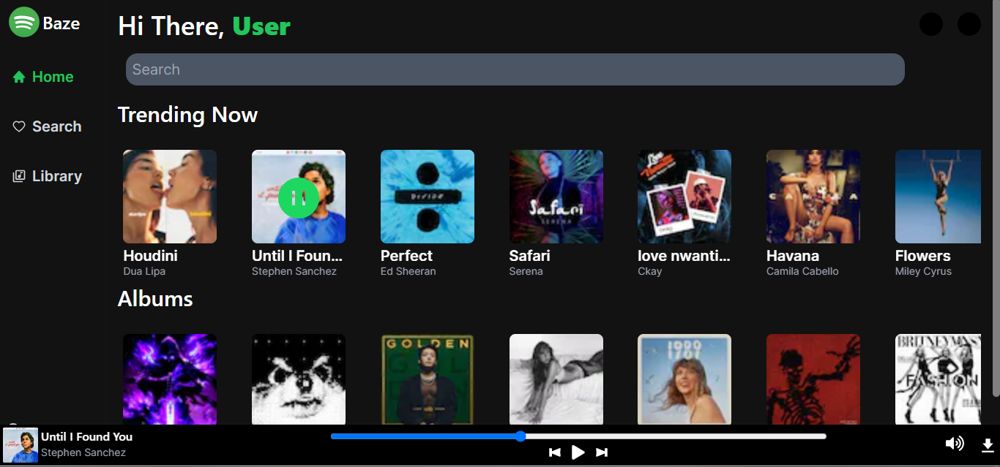

# Music Streaming and Downloading Web Application

This is a music streaming and downloading web application built using Next.js and the JioSaavn API. It allows users to search for their favorite songs, stream them online, and download them for offline listening. The application is designed to provide a seamless and enjoyable music listening experience.

## Live Preview

[Visit Live](https://baze-chi.vercel.app/)

## Landing Page

## Features

- Search for songs, albums, and artists.
- Stream music online.
- Download songs for offline listening.
- Responsive design for optimal viewing on various devices.
- Utilizes Tailwind CSS for styling.

## Technologies Used

- Next.js
- JioSaavn API [Check Out](https://github.com/sumitkolhe/jiosaavn-api)
- Tailwind CSS

## Installation

1. Clone the repository.
2. Install dependencies using `npm install`.
3. Obtain API access from JioSaavn and replace the placeholder API keys in the code with your own.
4. Run the application using `npm run dev`.
5. Open your browser and navigate to `http://localhost:3000` to view the application.

## Usage

- On the landing page, users can search for songs, albums, or artists using the search bar.
- Clicking on a search result will take users to a page where they can stream the song or album.
- Users can also download songs for offline listening by clicking the download button.

## Contributing

Contributions are welcome! Feel free to fork the repository, make your changes, and submit a pull request. Please follow the existing code style and make sure to thoroughly test your changes.

## License

This project is open source and available under the [MIT License](LICENSE).

---
